# Serverless Blacklist Ingestion

This folder contains a first production-shaped serverless ingestion stack for blacklist-style phishing feeds.

## Current Deployment

- Region: `ap-east-2`
- Stack: `blacklist-ingestion`
- Runtime target: AWS Lambda + Step Functions + DynamoDB + S3 + API Gateway REST API
- Local bootstrap tool: [upload_tw165_snapshot.py](/D:/Coding/kiro_hackathon_2026/model-training/SpecularNet/upload_tw165_snapshot.py)
- Default Lambda tracing mode: `PassThrough`
- Default Lambda log retention: `14 days`

## Architecture

Dark-mode optimized static SVG:



Mermaid source: [architecture.mmd](docs/architecture.mmd)

## Flow

Dark-mode optimized static SVG:



Mermaid source: [flow.mmd](docs/flow.mmd)

## Why SAM instead of plain CloudFormation

AWS SAM is still CloudFormation under the hood, but it removes a lot of boilerplate for:

- Lambda packaging and deployment
- Step Functions definitions and permissions
- EventBridge Scheduler wiring with `ScheduleV2`

For this stack, SAM is the shortest path to a fully deployable template while keeping the result as a single CloudFormation stack.

## What the stack deploys

- One S3 bucket for `raw/`, `normalized/`, and `curated/` artifacts
- One DynamoDB table for source state, workflow lock metadata, and the currently published curated run pointer
- One DynamoDB table for low-latency blacklist lookups
- Workflow Lambdas for:
  - acquiring and releasing the ingestion lock
  - reducing collection results into `changed_count` / `needs_processing`
  - collecting one source
  - building run-scoped curated artifacts
  - syncing the lookup index
  - publishing the successful run as `latest`
- One HTTP API + Lambda for blacklist lookups
- One Step Functions state machine that serializes executions, runs the collection fan-out, and publishes only successful curated runs
- One EventBridge Scheduler trigger that periodically starts the state machine
- One scheduler DLQ that SAM auto-creates from the `ScheduleV2` dead-letter config

## Execution Semantics

- `CollectSource` now has three short-circuit modes before downstream work:
  - `not_modified_304`
  - `same_payload_hash`
  - `same_records_hash`
- The workflow acquires a DynamoDB lease item before touching shared state:
  - overlapping scheduled/manual runs exit with `skipped=true` and `skip_reason="run_in_progress"`
  - the lease is explicitly released on both success and failure paths
- A reducer Lambda computes `changed_count`, normalizes `lookup_sync_mode`, and decides whether merge/sync are required.
- `MergeCurated` no longer scans mutable source-state rows for inputs:
  - it reads explicit `collection_results`
  - partitions normalized records into run-scoped artifacts under `curated/runs/<run_id>/...`
  - diffs each partition against the previously published run manifest
- `SyncLookupIndex` consumes the run manifest directly:
  - delta mode applies run-scoped `new` / `changed` / `removed` partitions
  - rebuild mode rewrites every current combined record and removes stale or legacy lookup rows with a strong-consistent projected cleanup sweep
- `PublishLatest` runs only after lookup sync succeeds:
  - `__meta__#curated_latest` in DynamoDB is the authoritative latest-published pointer
  - `curated/latest/manifest.json` is a derived convenience pointer that is refreshed best-effort from the same data
- Lookup metadata is stored in the same DynamoDB table under `indicator_key="__meta__#lookup_index"`.

## Sources in v1

- OpenPhish Community Feed
- PhishTank verified online feed
- Taiwan 165 fake investment and gambling article API
- Taiwan 165 stopped-fraud domains open dataset
- Taiwan 165 fake investment and gambling sites open dataset

## Deploy

Prerequisites:

- AWS CLI configured for the target account and region
- AWS SAM CLI installed

Commands:

```powershell
cd infra\serverless-blacklist-ingestion
sam build
sam deploy --guided
```

After your first guided deploy writes a local `samconfig.toml`, the common non-interactive flow is:

```powershell
cd infra\serverless-blacklist-ingestion
sam validate
sam build
sam deploy
```

Suggested deploy inputs:

- Stack name: `blacklist-ingestion`
- Region: choose the region where you want S3, Lambda, and Step Functions to live
- `ScheduleExpression`: keep the default `cron(0 3,15 * * ? *)` for twice-daily Taipei time runs
- `ScheduleTimezone`: keep `Asia/Taipei`
- `PhishTankAppKey`: optional; leave blank for the public downloadable feed
- `ExistingArtifactsBucketName`: optional; set this if you want this ingestion stack to write into a shared platform bucket instead of creating its own bucket

## Manual run

After deploy, you can manually start the workflow from the Step Functions console or with AWS CLI:

```powershell
aws stepfunctions start-execution `
  --state-machine-arn <workflow-arn> `
  --input "{\"trigger\":\"manual\",\"requested_by\":\"cli\"}"
```

## Operator Runbook

### Manual execution modes

- Normal manual publish:

  ```powershell
  aws stepfunctions start-execution `
    --state-machine-arn <workflow-arn> `
    --input "{\"trigger\":\"manual\",\"requested_by\":\"cli\",\"lookup_sync_mode\":\"delta\"}"
  ```

- Full lookup rebuild:

  ```powershell
  aws stepfunctions start-execution `
    --state-machine-arn <workflow-arn> `
    --input "{\"trigger\":\"manual\",\"requested_by\":\"cli\",\"lookup_sync_mode\":\"rebuild\"}"
  ```

Use `lookup_sync_mode="rebuild"` when you need to fully reconcile the lookup table with the current curated run, such as after key-format migrations or suspected table drift. Normal operator-triggered runs should stay on `delta`.

### Expected durations

Live executions on 2026-03-26 in `ap-east-2` established these baselines:

- overlap rejection: about `4s`
- manual delta publish: about `121s`
- manual rebuild: about `173s`

Treat those as current reference points, not hard SLOs. The delta path depends on upstream feed churn. The rebuild path depends on current lookup-table size because it rewrites the full combined set and then scans for stale rows.

### Metadata items

The workflow publishes two control-plane metadata records:

- `SourceStateTable`, `source_id="__meta__#curated_latest"`
  - `run_id`: the currently published curated run
  - `manifest_key`: the immutable run manifest under `curated/runs/<run_id>/manifest.json`
  - `published_at`: when `PublishLatest` advanced the authoritative DynamoDB pointer
  - `schema_version`: curated artifact schema version
  - `combined_record_count`, `delta_counts`, `source_count`: summary of the published run

- `LookupIndexTable`, `indicator_key="__meta__#lookup_index"`
  - `run_id`: the last lookup sync execution
  - `sync_mode`: `delta` or `rebuild`
  - `last_rebuild_run_id`: the most recent successful full rebuild
  - `upserted_count`, `new_count`, `changed_count`, `deleted_count`: lookup-table mutation counts for that sync
  - `manifest_key`: curated run manifest used as lookup input
  - `collection_summary`: per-source short-circuit and status summary for the same execution

### Interpretation

- Healthy publish:
  - `__meta__#curated_latest.run_id` points at the newest successfully published run and is the source of truth
  - `curated/latest/manifest.json` usually points at the same `manifest_key`, but it is derived state and can be repaired if a transient S3 write fails
  - `__meta__#lookup_index.manifest_key` matches the published run manifest for the latest successful sync

- Healthy rebuild:
  - `__meta__#lookup_index.sync_mode` is `rebuild`
  - `__meta__#lookup_index.last_rebuild_run_id` matches the rebuild execution `run_id`
  - `deleted_count` can be large on the first rebuild after a schema change because it removes stale and legacy rows

- Overlap behavior:
  - a second execution started while another run holds the lease should finish quickly with `skipped=true`
  - `skip_reason` should be `run_in_progress`
  - the output `lock.current_owner_run_id` identifies the run that currently owns the lease

If a run fails before `PublishLatest`, the authoritative latest pointer must not advance. In that case, inspect the failed execution, then compare `__meta__#curated_latest.run_id` against the failed run ID before retrying.

If `PublishLatest` succeeds with `published_latest.s3_pointer_written=false`, treat the publish as successful. The authoritative pointer is already stored in DynamoDB; repair `curated/latest/manifest.json` from `__meta__#curated_latest.manifest_key` when convenient.

## Latest Measured Runtime

Measured on live executions in `ap-east-2` on 2026-03-26 after the run-scoped refactor shipped:

- Manual delta publish run `blacklist-delta-20260326053305`:
  - `05:32:08` -> `05:34:09` Asia/Taipei, about `121s`
  - `phishtank_online_valid` changed, so the workflow rebuilt the current run artifacts and performed the first post-migration publish
  - output: `combined_record_count=138209`, `delta_counts.new=138209`
- Manual overlap run `blacklist-overlap-20260326053350`:
  - `05:33:15` -> `05:33:19` Asia/Taipei, about `4.2s`
  - output: `skipped=true`, `skip_reason="run_in_progress"`
  - the lock holder recorded in the result was `blacklist-delta-20260326053305`
- Manual rebuild run `blacklist-rebuild-20260326053440`:
  - `05:34:21` -> `05:37:14` Asia/Taipei, about `173s`
  - all five sources short-circuited unchanged, but `lookup_sync_mode="rebuild"` forced merge + full lookup reconciliation
  - output: `upserted_count=138209`, `deleted_count=48705`, `last_rebuild_run_id=blacklist-rebuild-20260326053440`

Live API validation after rebuild:

- a lookup for `https://www.makerakh.com/` returned `found=true`
- a lookup for `https://openphish.com/` returned exactly two candidates:
  - the URL itself
  - the parsed domain `openphish.com`

## Latest Measured Cost

The numbers below are marginal estimates per execution and intentionally ignore AWS Free Tier, taxes, and tiny control-plane drift.

Validated against:

- [AWS Lambda pricing](https://aws.amazon.com/lambda/pricing/)
- [Amazon API Gateway pricing](https://aws.amazon.com/api-gateway/pricing/)
- [Amazon DynamoDB pricing](https://aws.amazon.com/dynamodb/pricing/)
- [AWS Step Functions pricing](https://aws.amazon.com/step-functions/pricing/)

Region-specific unit prices for `ap-east-2` / `Asia Pacific (Taipei)` were also checked live through the AWS Price List API on 2026-03-26:

- Lambda duration: `$0.000015 / GB-s`
- Lambda request: `$0.00000018 / request`
- DynamoDB on-demand write: `$0.6435 / million WRUs`
- DynamoDB on-demand read: `$0.1602 / million RRUs`
- API Gateway REST requests: `$3.825 / million requests`
- S3 Standard PUT/COPY/POST/LIST: `$0.00423 / 1,000 requests`
- S3 Standard storage: `$0.0225 / GB-month`
- Step Functions Standard: pricing page reference rate of `$0.000025 / state transition`

Steady-state no-change run, using live billed durations from CloudWatch REPORT lines:

| Component | Observed usage | Approx cost |
| --- | ---:| ---:|
| CollectSource Lambda | `11.933s` billed at `512 MB` = `5.9665 GB-s` | `$0.000089` |
| MergeCurated Lambda | skipped in fast path | `$0.000000` |
| SyncLookupIndex Lambda | skipped in fast path | `$0.000000` |
| Lambda requests | `5 invokes` | `$0.000001` |
| Step Functions | about `8 state transitions` | `$0.000200` |
| S3 requests | negligible in fast path after source short-circuiting | about `$0.000010` |
| DynamoDB ops | source-state reads/writes only | about `$0.000003` |
| **Total** |  | **about `$0.00030 / run`** |

At a twice-daily schedule, that is roughly:

- about `$0.055 / month` before Free Tier
- about `$0.018 / month` before Free Tier at two no-change executions per day

Lookup API per request is separate from the ingestion workflow. A single exact-match lookup is currently dominated by API Gateway request cost and is still extremely small:

- API Gateway REST request: about `$0.000003825`
- Lambda request + duration: well under `$0.000001`
- DynamoDB `GetItem` reads: well under `$0.000001`

So a single lookup call is on the order of:

- about `$0.000004` to `$0.000005 / lookup`

## Current Storage Footprint

The curated artifact layout is now:

- immutable run data under `curated/runs/<run_id>/...`
- one lightweight published pointer at `curated/latest/manifest.json`

The pre-refactor prefix-level size numbers for `curated/latest/` and `curated/deltas/` are no longer current. Re-measure S3 footprint against `curated/runs/` after more post-migration executions accumulate.

## Hidden And Additional Cost Notes

The current stack avoids several common hidden serverless costs because it does **not** use:

- VPC networking
- NAT Gateway
- PrivateLink / VPC endpoints
- API Gateway cache
- WAF
- custom domains
- CloudFront

So there is no meaningful cross-AZ data transfer design risk introduced by our own architecture. All major services are regional managed services in `ap-east-2`, and AWS decides the underlying AZ placement.

Still, the following costs do exist and should be considered part of the real total cost of ownership:

- CloudWatch Logs ingestion and retention for Lambda logs
- AWS X-Ray tracing if `LambdaTracingMode` is set to `Active`
- EventBridge Scheduler invocations
- SQS DLQ requests and storage, if failures occur
- API Gateway response data transfer out
- S3 request and storage costs for `raw/`, `normalized/`, `curated/runs/`, and `curated/latest/manifest.json`
- DynamoDB storage for the lookup and source-state tables

Current live behavior suggests that the main recurring cost drivers are still:

- Lambda duration for `MergeCurated`
- Step Functions state transitions
- S3 PUT/GET/LIST activity
- DynamoDB request units

The main long-tail storage risk is retained immutable run artifacts. This stack now adds an S3 lifecycle rule for `curated/runs/` so historical run payloads do not grow forever.

The stack also now reduces two operational cost risks by default:

- Lambda log groups are explicitly retained for `14` days
- Lambda tracing defaults to `PassThrough` instead of `Active`

## Output layout

S3 object prefixes:

- `raw/<source_id>/<run_id>/payload.*`
- `normalized/<source_id>/<run_id>/records.jsonl.gz`
- `curated/runs/<run_id>/combined/part-<00..0f>.jsonl.gz`
- `curated/runs/<run_id>/deltas/new/part-<00..0f>.jsonl.gz`
- `curated/runs/<run_id>/deltas/removed/part-<00..0f>.jsonl.gz`
- `curated/runs/<run_id>/deltas/changed/part-<00..0f>.jsonl.gz`
- `curated/runs/<run_id>/manifest.json`
- `curated/latest/manifest.json`

## Lookup API

The stack now also maintains an exact-match DynamoDB lookup index and exposes an HTTP API.

- `GET /lookup?indicator=https://example.com/`
- `GET /lookup?url=example.com/path`
- `GET /lookup?domain=example.com`
- `POST /lookup`

Example POST body:

```json
{"indicator":"https://example.com/path"}
```

Lookup behavior:

- exact URL lookup when a URL is provided
- domain fallback when a URL is provided
- exact domain lookup when a domain is provided

The response also includes:

- `index_metadata.generated_at`
- `index_metadata.delta_counts`
- `index_metadata.collection_summary`

## Notes

- OpenPhish community data is not the same as the paid SQLite database.
- PhishTank public downloads should be scheduled conservatively unless you use an application key.
- The Taiwan 165 article source comes from the official `165.npa.gov.tw` API and currently returns the full article backlog in one JSON response.
- The Taiwan 165 open-data CSVs update irregularly and may lag or differ from the article feed because they reflect separate publication and stop-resolution workflows.
- `curated/latest/manifest.json` is now a lightweight derived pointer to the published run manifest, not the full curated dataset itself.
- `__meta__#curated_latest` in DynamoDB is the authoritative latest-published record.
- Manual executions can request `lookup_sync_mode="rebuild"` to fully reconcile the lookup table with the current curated run.
- This stack now supports either:
  - a dedicated bucket created by the stack
  - or a shared existing bucket, while keeping DynamoDB as a dedicated ingestion state table
